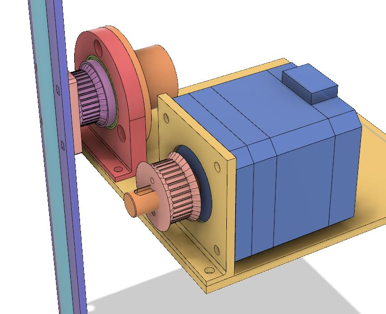

# POVSpinner

A spinning light animation that uses Persistence-of-vision.

## Demo

[start](https://www.instagram.com/p/Br9ADS2HSqk/)
[better](https://www.instagram.com/p/Br9ITGbnAZ6/)
[finished](https://www.instagram.com/p/BsEod8YnH0e/)

## Parts (off the shelf)

1x [Slip ring](https://www.adafruit.com/product/736)
14x WS2811 LEDs @ 16.5mm spacing.
1x RUMBA board OR 1x Arduino Mega + RAMPs board
1x A4988 stepper driver
1x 12v2a power supply
8x M3x10 pan head phllips screws
1x 160mm GT2-6 timing belt
1x NEMA17 stepper motor (200-step-per-turn)
1x 20x27x4 bearing
2x M2x10 screwss
2x 2mm zap straps (zip ties)
A breadboard
Some wires

## Parts (manufactured)

LEDPlate (laser cut).  STL file has been included as an alternative.
MountingPlate (laser cut).  STL file has been included as an alternative.

All other STL files were 3D printed on a Prusai3Mk3 at default settings.
Most parts are a snug friction fit.

## Assembly

If this part is actually troubling you, open a ticket.

## Wiring

Pin 54 --> Slip ring red wire --> LED D0.
5v --> Slip ring white wire --> LED 5V.
GND --> Slip ring black wire --> LED G.

Stepper motor connected to X axis.
A4988 connected to X axis.